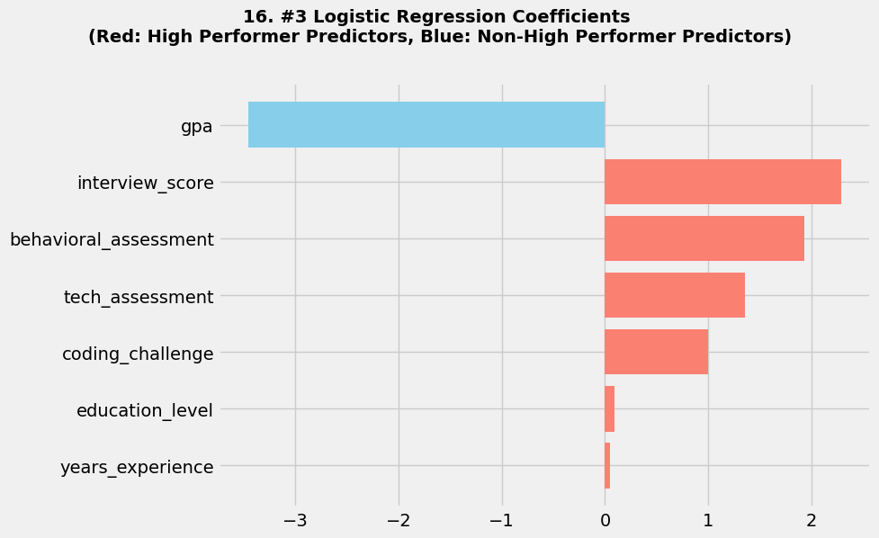

# 🚀 Employee Performance Prediction: A Merit-Based People Analytics Approach

## 📌 Project Overview
This project aims to predict high-performing employees using recruitment and assessment data. The primary objective was to build a model that is not only highly accurate but also **interpretable, ethically sound, and robust** enough to support strategic HR decision-making.

---

## 🛠️ The Challenge: Mitigating Data Leakage
In the initial phase, the model achieved a suspicious **98% accuracy**. A deep dive revealed **Proxy Data Leakage**, where interview scores, technical scores and years of experience overly dominated the prediction. To build a more reliable model, I conducted **3 iterations of feature refinement**:

1.  **Iteration 1:** Baseline model (All features). 98% Accuracy (Identified as Leakage).
2.  **Iteration 2:** Dropped `interview score`, `tech_assessment` & `years_experience`. Logistic Regression remained stable at **91%**, proving the strength of behavioral predictors.
3.  **Iteration 3 (Final):** Dropped `source` (Recruitment channel). This was a strategic decision to ensure a **merit-based model** that ignores candidate origin and focuses purely on individual competency.

---

## 📊 Model Performance Comparison
The following table highlights how each model reacted as we refined the feature set to eliminate bias and leakage.

| Iteration | Model | Accuracy | Precision | Recall | Note |
| :--- | :--- | :---: | :---: | :---: | :--- |
| **1** | LogReg / XGBoost | 98% | 0.95 | 1.00 | **Leakage Detected** |
| **2** | **Logistic Regression** | **91%** | 0.87 | 0.95 | **Stable & Robust** |
| | XGBoost | 85% | 0.82 | 0.86 | Significant Performance Drop |
| **3** | **Logistic Regression** | **91%** | 0.87 | 0.95 | **Consistent Result** |
| | XGBoost | 93% | 0.88 | 1.00 | Volatile Recovery |

While XGBoost showed a slightly higher accuracy in the final iteration, it demonstrated high sensitivity to small data changes. Logistic Regression was selected due to its **consistent 91% accuracy** and its ability to provide clear, actionable coefficients for HR leadership.

 
---

## 🏁 Conclusion & Recommendations

### 1. Model Reliability & Integrity
The iterative testing proved that **Logistic Regression** is the most robust model for this dataset. With a **0.95 Recall**, the model effectively identifies nearly all top-tier talent with minimal risk of missing out on high-potential candidates (*false negatives*). Also Logistic Regression provides clear coefficients, allowing HR leaders to understand the actual drivers of high performance.

### 2. Strategic HR Insights
* **Prioritize Behavioral Assessments:** Since behavioral scores remained a stable predictor even after removing technical data, the company should continue investing in validated psychological and soft-skill testing.
* **Standardize Interviews:** Given that `interview_score` is a stronger predictor than academic background (GPA), implementing structured interview guidelines is recommended to maintain objectivity.

---

## 🚀 Technologies Used
* **Core:** Python (Pandas, NumPy)
* **ML Libraries:** Scikit-Learn, XGBoost
* **Visualization:** Matplotlib, Seaborn
* **Validation:** 5-Fold Cross-Validation

## 📂 File Structure
* `images/`: Feature distributions and evaluation matrices.
* `data/`: Anonymized dataset.
* `notebooks/`: Iterative experiment documentation.
